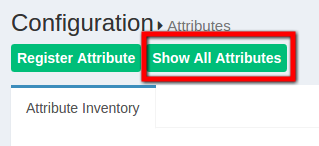
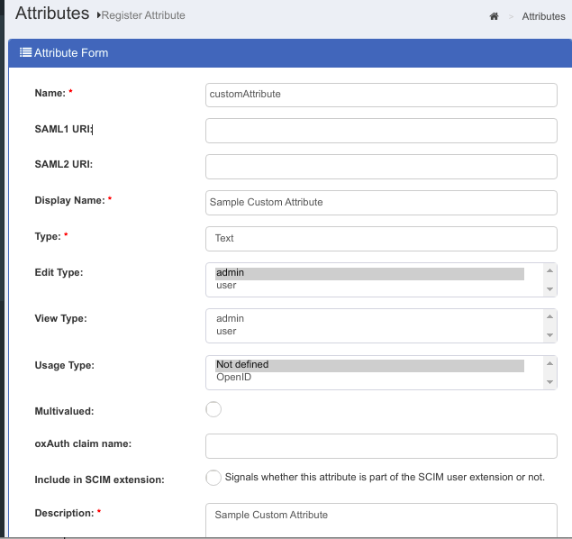
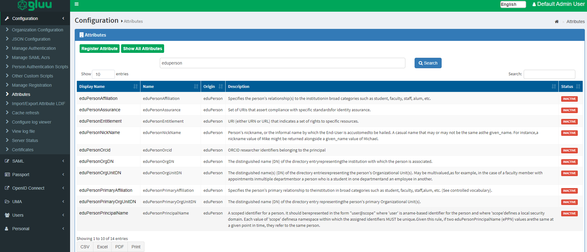

# Attributes

## Overview
Attributes are individual pieces of user data, like `uid` or `email`, that are required by applications in order to identify a user and grant access to protected resources. The user attributes that are available in your Gluu service can be found by navigating to `Configuration` > `Attributes`. 


The Gluu Server has a large LDAP tree which includes all standard attributes. It is not necessary for all of them to be *Active*. The
active LDAP trees can be sorted using the *Show only Active Attributes* link.



The Gluu Server administrator can make changes to attributes, such as changing their status to active/inactive, by clicking on a specific attribute.


## Custom Attributes
In order to create SSO to certain applications you may need to add custom attributes to your Gluu Server. Custom attributes can be added by following the instructions below: 

### Add custom attributes to LDAP

#### OpenDJ

=== "Community Edition Setup"

    1.  In OpenDJ, add custom attributes to `/opt/opendj/config/schema/77-customAttributes.ldif`:
    
        - In the below example, `customTest` is our custom attribute. Kindly note this is just an example.
 
        ```
        dn: cn=schema
        objectClass: top
        objectClass: ldapSubentry
        objectClass: subschema
        cn: schema
        attributeTypes: ( 1.3.6.1.4.1.48710.1.3.1400 NAME 'customTest'
          DESC 'Custom Attribute' 
          EQUALITY caseIgnoreMatch 
          SUBSTR caseIgnoreSubstringsMatch 
          SYNTAX 1.3.6.1.4.1.1466.115.121.1.15 
          X-ORIGIN 'Gluu custom attribute' )
        ```

        - Add custom attribute to the `gluuCustomPerson` objectClasses:
  
        ```
        objectClasses: ( 1.3.6.1.4.1.48710.1.4.101 NAME 'gluuCustomPerson'
          SUP ( top )
          AUXILIARY
          MAY ( customTest $ telephoneNumber $ mobile $ carLicense $ facsimileTelephoneNumber $ departmentNumber $ employeeType $ cn $ st $ manager $ street $ postOfficeBox $ employeeNumber $ preferredDeliveryMethod $ roomNumber $ secretary $ homePostalAddress $ l $ postalCode $ description $ title )
        ```

        - The complete `77-customAttributes.ldif` will look like this:
      
        ```
        dn: cn=schema
        objectClass: top
        objectClass: ldapSubentry
        objectClass: subschema
        cn: schema
        attributeTypes: ( 1.3.6.1.4.1.48710.1.3.1400 NAME 'customTest'
          DESC 'Custom Attribute' 
          EQUALITY caseIgnoreMatch 
          SUBSTR caseIgnoreSubstringsMatch 
          SYNTAX 1.3.6.1.4.1.1466.115.121.1.15 
          X-ORIGIN 'Gluu custom attribute' )
        objectClasses: ( 1.3.6.1.4.1.48710.1.4.101 NAME 'gluuCustomPerson'
          SUP ( top )
          AUXILIARY
          MAY ( customTest $ telephoneNumber $ mobile $ carLicense $ facsimileTelephoneNumber $ departmentNumber $ employeeType $ cn $ st $ manager $ street $ postOfficeBox $ employeeNumber $ preferredDeliveryMethod $ roomNumber $ secretary $ homePostalAddress $ l $ postalCode $ description $ title )
        ```
    
        !!! Warning

          Spacing is extremely important in the customs attributes file above. There must be 2 spaces before and 1 after every entry (i.e. DESC), or your custom schema will fail to load properly because of a validation error.

          You cannot have line spaces between `attributeTypes:` or `objectClasses:`. This will cause failure in schema. Please check the error logs in /opt/opendj/logs/errors if you are experiencing issues with adding custom schema. This will help guide you on where there may be syntax errors.

          1.  - [Restart](../operation/services.md#restart) the `opendj` service.

That will create the attribute in the local LDAP server. You can navigate to `Configuration` > `Attributes` in the UI to see the added attribute. 


=== "Cloud Native Setup"

    1. Create a file named 77-customAttributes.ldif and load it with the custom attributes that you want.

        - In the below example, `customTest` is our custom attribute. Kindly note this is just an example.
 
        ```
        dn: cn=schema
        objectClass: top
        objectClass: ldapSubentry
        objectClass: subschema
        cn: schema
        attributeTypes: ( 1.3.6.1.4.1.48710.1.3.1400 NAME 'customTest'
          DESC 'Custom Attribute' 
          EQUALITY caseIgnoreMatch 
          SUBSTR caseIgnoreSubstringsMatch 
          SYNTAX 1.3.6.1.4.1.1466.115.121.1.15 
          X-ORIGIN 'Gluu custom attribute' )
        ```

        - Add custom attribute to the `gluuCustomPerson` objectClasses:
      
        ```
        objectClasses: ( 1.3.6.1.4.1.48710.1.4.101 NAME 'gluuCustomPerson'
          SUP ( top )
          AUXILIARY
          MAY ( customTest $ telephoneNumber $ mobile $ carLicense $ facsimileTelephoneNumber $ departmentNumber $ employeeType $ cn $ st $ manager $ street $ postOfficeBox $ employeeNumber $ preferredDeliveryMethod $ roomNumber $ secretary $ homePostalAddress $ l $ postalCode $ description $ title )
        ```

        - The complete `77-customAttributes.ldif` will look like this:
      
        ```
        dn: cn=schema
        objectClass: top
        objectClass: ldapSubentry
        objectClass: subschema
        cn: schema
        attributeTypes: ( 1.3.6.1.4.1.48710.1.3.1400 NAME 'customTest'
          DESC 'Custom Attribute' 
          EQUALITY caseIgnoreMatch 
          SUBSTR caseIgnoreSubstringsMatch 
          SYNTAX 1.3.6.1.4.1.1466.115.121.1.15 
          X-ORIGIN 'Gluu custom attribute' )
        objectClasses: ( 1.3.6.1.4.1.48710.1.4.101 NAME 'gluuCustomPerson'
          SUP ( top )
          AUXILIARY
          MAY ( customTest $ telephoneNumber $ mobile $ carLicense $ facsimileTelephoneNumber $ departmentNumber $ employeeType $ cn $ st $ manager $ street $ postOfficeBox $ employeeNumber $ preferredDeliveryMethod $ roomNumber $ secretary $ homePostalAddress $ l $ postalCode $ description $ title )
        ```

        !!! Warning

          Spacing is extremely important in the customs attributes file above. There must be 2 spaces before and 1 after every entry (i.e. DESC), or your custom schema will fail to load properly because of a validation error.

          You cannot have line spaces between `attributeTypes:` or `objectClasses:`. This will cause failure in schema. Please check the error logs in /opt/opendj/logs/errors if you are experiencing issues with adding custom schema. This will help guide you on where there may be syntax errors.
    
    1. Create a kubernetes configmap called `ldap-custom-attributes` targeting the content of the file you created above.

        ```sh
        kubectl create cm ldap-custom-attributes -n <namespace> --from-file=/path/to/77-customAttributes.ldif
        ```

        - Check if the configmap has been created by running the following command:

        ```sh
        kubectl get cm -n <namespace>
        ```

  
    1. Open your `values.yaml` file and mount the file as a volume under `opendj`.
    
        ```yaml
        opendj: 
            volumes:
              - name: ldap-custom-attributes
                configMap:
                  name: ldap-custom-attributes
            volumeMounts:
              - name: ldap-custom-attributes
                mountPath: "/opt/opendj/config/schema/77-customAttributes.ldif"
                subPath: 77-customAttributes.ldif    
        ```
        
    1. Navigate to the folder where the values.yaml is `helm/gluu` and do the helm upgrade with the following command

        ```sh
        helm upgrade <release-name> . -f values.yaml -n <namespace>
        ```

    1. Restart the `opendj` service to ensure custom attributes are loaded. Note that we restart the service by scaling down to 0, waiting for a bit and scaling back up to 1. We do that with the following commands

        ```sh
        kubectl scale sts <release-name>-opendj -n <namespace> --replicas=0
        ```

        Wait for a bit for the scaling down to happen, then scale back up.

        ```sh
        kubectl scale sts <release-name>-opendj -n <namespace> --replicas=1
        ```

That will create the attribute in the local LDAP server. You can navigate to `Configuration` > `Attributes` in the UI to see the added attribute.   
    
### Addition of custom attributes to a setup using MySQL backend

1. Add a column to table `gluuPerson` in MySQL. Command will be
  `ALTER TABLE gluuPerson ADD COLUMN <claimName> <dataType>;`

  Choose dataType according to the following table

  | Gluu oxTrust UI Type | SQL dataType                                                                      |
  | -------------------- | --------------------------------------------------------------------------------- |
  | Text                 | VARCHAR(<SIZE>) *string value to be kept, SIZE is an integer for max string size* |
  | Numeric              | INT                                                                               |
  | Boolean              | SMALLINT                                                                          |
  | Binary               | BINARY                                                                            |
  | Certificate          | TEXT                                                                              |
  | Date                 | DATETIME(3)                                                                       |
  | Numeric              | INT                                                                               |
  | Multivalued          | JSON                                                                              |

  !!! Note
      if the attribute is Multivalued, **dataType** should be JSON regardless of what you will choose for Type in Gluu oxTrust UI.

2. [Register](#add-the-attribute-to-oxtrust) an attribute in the Gluu oxTrust UI. When registering attribute **Name** `claimName`.


#### Example

We are going to add simple text attribute **customAttribute** with max size 200 characters.

  1. Use the following SQL command to add column

  ```sql
  mysql> ALTER TABLE gluuPerson ADD COLUMN customAttribute VARCHAR(100);
  Query OK, 0 rows affected (0.04 sec)
  Records: 0  Duplicates: 0  Warnings: 0
  ```

  2. In the Gluu oxTrust UI, navigate to `Configuration` > `Attributes` and click **Register Attribute** button. Fill in the fields with your attribute values. 
  See the following screenshot shwoing the attribute form fields.
  
  

  Once you registered attribute, Go to `Users` > `Add person` > `Available User Claims` and check under `gluuPerson`

  

### Addition of custom attributes to oxTrust

To register the new attribute in the Gluu Server GUI, navigate to `Configuration` > `Attributes`  and click the `Register Attribute` button. 

You'll be redirected to the following page:


The following fields are supported;

* `Name` This field defines the name of the custom attribute. The name must be unique in the Gluu Server LDAP tree.

* `SAML1 URI` This field can contain a SAML v1 supported nameformat for the new attribute. If this field is left blank the Gluu Server will automatically populate a value. 

* `SAML2 URI` This field can contain a SAML v2 supported nameformat for the new attribute. If this field is left blank the Gluu Server will automatically populate a value. 

* `Display Name` The display name can be anything that is human readable.

* `Type` Select what type of attribute is being added in this field. The Gluu Server supports four types of attributes: text, numeric, photo, and date. Choose the option that best applies. 

* `Edit Type` This field controls who can edit this attribute. If `user` is selected, this will enable each user to edit this attribute in their Gluu server user profile (assuming oxTrust is user facing, and the "User can edit own profile" feature has been enabled).

* `View Type` This field controls which type of user is allowed to view
  corresponding attribute at his/her "Profile" page of the web UI.

* `Multivalued` If the attribute contains more than one value, set this field to True. 

* `oxAuth claim name` If this attribute will be used as a 'claim' in your OpenID Connect service, add the name of the claim here. Generally, the name of the attribute == name of the claim.

* `SCIM Attributes` If the attribute is a part of your SCIM architecture, set this field to True.

* `Enable custom validation for this attribute` If you plan to set minimum and maximum lengths or a regex pattern, as described below, you will need to enable custom validation for this attribute. Otherwise you can leave this disabled. 

* `Enable tooltip for this attribute` This allows you to set a tool tip for the attribute. 

* `Minimum Length` This is the minimum length of a value associated with this attribute. 

* `Maximum Length` This is the maximum length of a value associated with this attribute. 

* `Regex Pattern` You can set a regex pattern to enforce proper formatting of an attribute. For example, you could set a regex expression for an email attribute like this: `^[A-Z0-9._%+-]+@[A-Z0-9.-]+\\.[A-Z]{2,6}$`. This would make sure that a value is added for the attribute only if it follows standard email formatting.

* `Status` Used to mark the attribute as Active so that it can be used in your federation service or choose Inactive to create the attribute that can be activated at a later date. 

Click Register and now this new attribute should be available for release in your federation service. 

The default NameID for oxTrust generated SAML trust relationships is `transientID`. It's always a good idea to release the `transientID` as an attribute, as some SP's may not work otherwise. If there are other `NameID` requirements, a custom attribute must be created in oxTrust first before defining it as the `NameID`. Please review the [custom attributes](./attribute.md#custom-attributes) section of the docs to learn how to create custom attributes in oxTrust.

## SAML Attributes

In any SAML SSO transaction, your Gluu Server will need to release attributes about users to the target SP. Configuring your Gluu Server for SAML SSO is covered in the [SAML section of the documentation](./saml.md). 

### eduPerson Attributes

eduPerson attributes are disabled by default. If required those can be activated from oxTrust. Just search for specific attribute and list will appear. From there we can 'Activate' / 'Enable' them accordingly. 




## OpenID Connect Scopes

In OpenID Connect, scopes are used to group attributes and provide a human 
understandable description of the attributes. This improves usability when you need 
to prompt a person to approve the disclosure of attributes to a third party. Learn more about configuring your Gluu Server for OpenID Connect SSO in the [OpenID Connect section of the documentation](./openid-connect.md#scopes)
