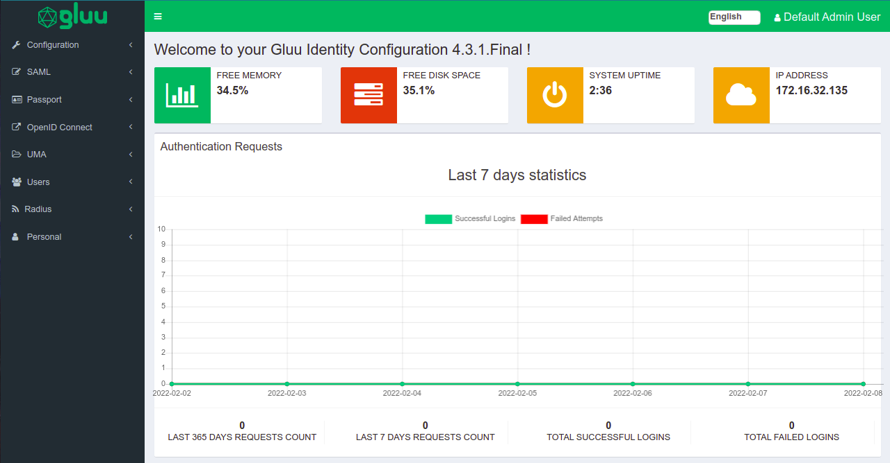
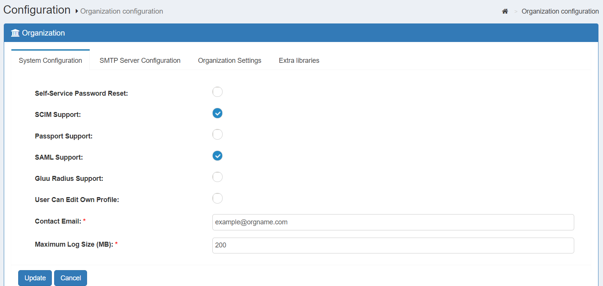
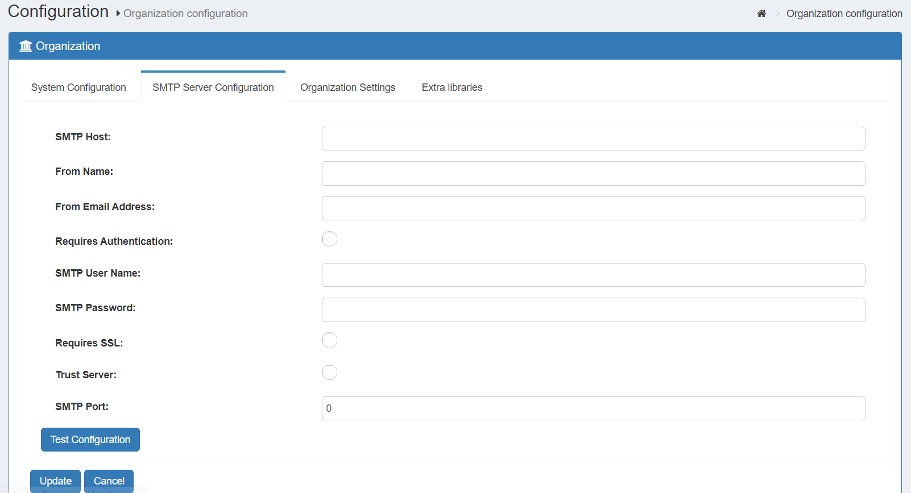
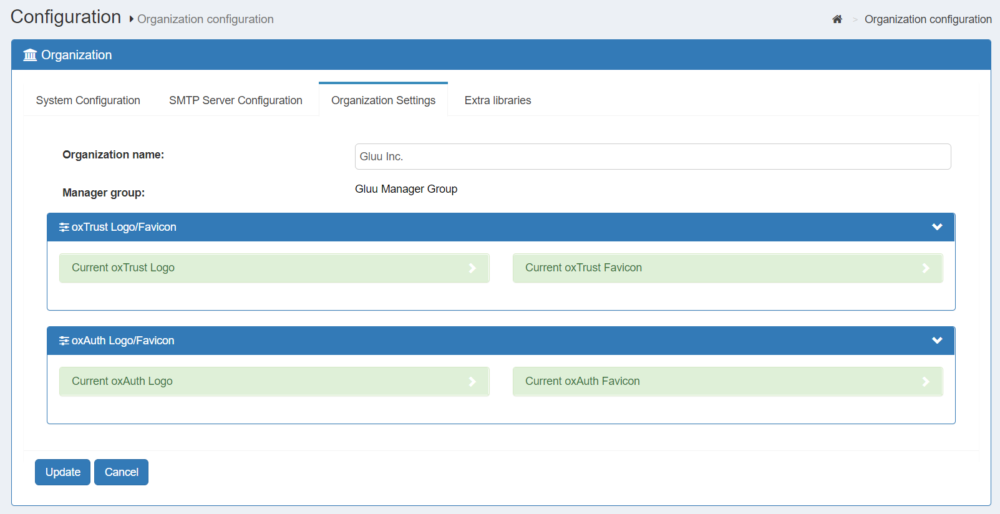
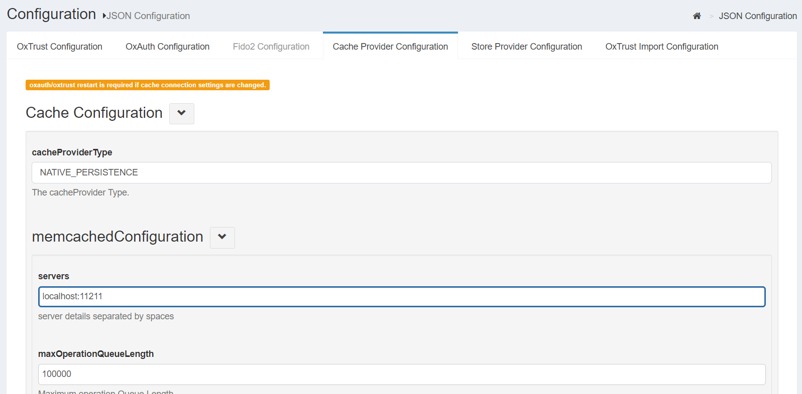
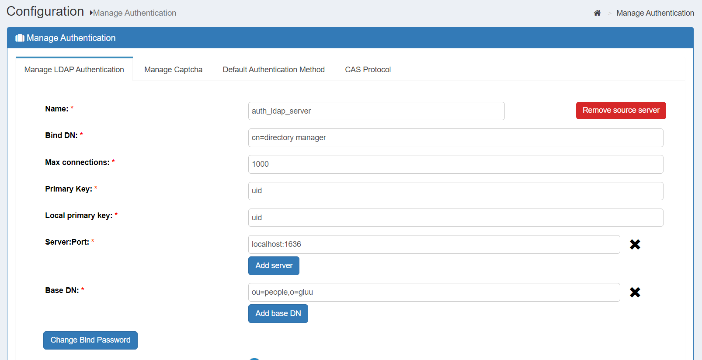
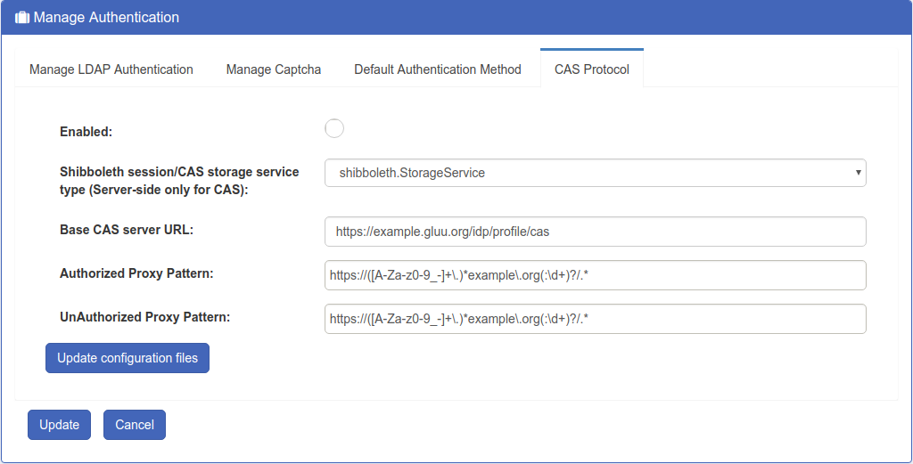
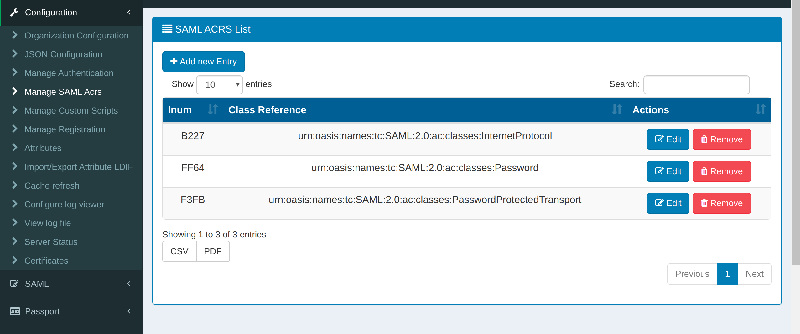
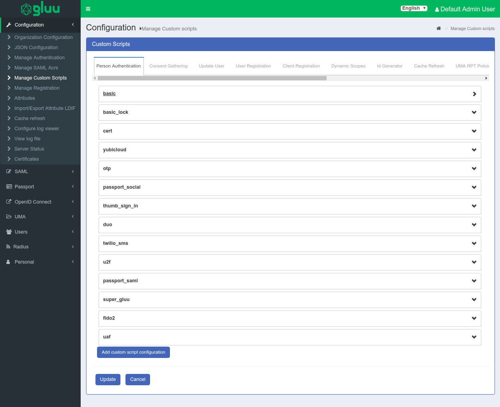
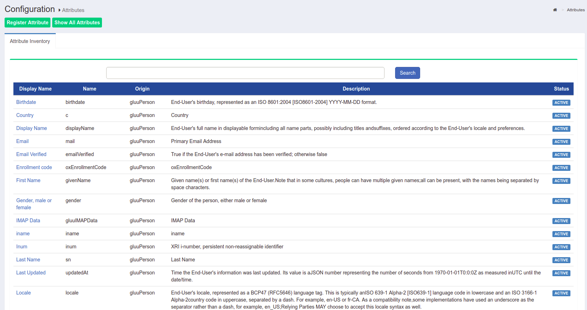

# oxTrust Administrative Graphical User Interface (GUI)

## Overview 
This section covers various features associated with managing your federation service via the Gluu Server interface ("oxTrust"). There is a corresponding page in the Gluu Server user interface for most of the sections below. When necessary, this document will link to dedicated sections within the docs where additional operational details are provided.

## Accessing the UI
The Gluu Server administration interface is accessible by navigating to `https://hostname` (the one you provided during setup). When you first complete an installation, the default username is `admin` and the password is the same as the `LDAP superuser` password. 

## Dashboard
After successful authentication, the administrator is taken to the Dashboard. Some basic information about the VM/server is displayed, as well as the server version, free memory, and disk space. A metrics graph is shown to report some quick statistics about user authentications handled by the service. In the top right, there is a user icon which can be used to log out of oxTrust. The left-hand menu is used to navigate the admin interface.

## Localization of oxTrust UI

The oxTrust UI supports localization. The default language is English. To set a new preferred language, edit a few properties file, found within `identity.war`. The path for `identity.war` is `/opt/gluu/jetty/identity`, which can be found in the `chroot` container.

oxAuth contains the following resource bundles:   
- [messages_en.properties](https://github.com/GluuFederation/oxAuth/tree/version_4.2/Server/src/main/resources/oxauth_en.properties)       
- [messages_bg.properties](https://github.com/GluuFederation/oxAuth/tree/version_4.2/Server/src/main/resources/oxauth_bg.properties)      
- [messages_de.properties](https://github.com/GluuFederation/oxAuth/tree/version_4.2/Server/src/main/resources/oxauth_de.properties)        
- [messages_es.properties](https://github.com/GluuFederation/oxAuth/tree/version_4.2/Server/src/main/resources/oxauth_es.properties)       
- [messages_fr.properties](https://github.com/GluuFederation/oxAuth/tree/version_4.2/Server/src/main/resources/oxauth_fr.properties)     
- [messages_it.properties](https://github.com/GluuFederation/oxAuth/tree/version_4.2/Server/src/main/resources/oxauth_it.properties)    
- [messages_ru.properties](https://github.com/GluuFederation/oxAuth/tree/version_4.2/Server/src/main/resources/oxauth_ru.properties)      
- [messages_tr.properties](https://github.com/GluuFederation/oxAuth/tree/version_4.2/Server/src/main/resources/oxauth_tr.properties)      

These properties files store the translatable text of the messages to be displayed. The default properties file, `messages_en.properties`, contains the following lines:

	.......
	login.login=Login
	login.register=Register
	.......

Now that the messages are in a properties file, they can be translated into various languages. No changes to the source code are required. For example, to use the French version of oxAuth, the messages_fr.properties should contain these lines:

	
	.......
	login.login=S'identifier
	login.register=Registre
	.......
	
Notice that the values to the right of the equal sign have been translated but the keys on the left side have not changed. These keys must not change, because they will be referenced when oxAuth fetches the translated text.

To add a translation for not yet supported languages, just create new properties file in resource folder and name it `messages_[language_code].properties`, then add the language code as supported-locale to the `faces-config.xml`.

oxTrust UI can be used to change the language once oxtrust_[language_code].properties are added in the `identity.war`, and select the preferred language from the dropdown as shown below.

## Configuration   
From the configuration tab, the Gluu Server administrator can manage certain non-protocol related tasks.

### Organization Configuration

There are four tabs in the organization configuration page:       

1. [System Configuration](#system-configuration)         
1. [SMTP Server Configuration](#smtp-server-configuration)         
1. [Organization Settings](#organization-settings)             
1. [Extra Libraries](#extra-libraries)

#### System Configuration

- Self-service password reset: Allow users to trigger the password reset sequence by following a URL like `https://your.idp.host/identity/person/passwordReminder.htm`. A new password will be sent to the email box provided in "Email" attribute of their user entry (if any). In order for this feature to work, the admin will also need to perform [SMTP Server Configuration](#smtp-server-configuration)      

- SCIM Support: Enable SCIM Support if you plan on using the SCIM protocol to move identity data from applications to Gluu and vice versa      

- Passport Support: Enable Passport Support, if you plan on using Passport protocol to allow authentication to applications from Gluu and vice versa 

- DNS Server(s): If the organization uses any custom `DNS Server(s)`, the address should be added here 

- Maximum Log Size (MB): By default the maximum size of the log file is 200 MB. This value can be increased or decreased depending on the organizations requirements     

- User can edit their own profile: oxTrust has a profile section for each user. If this option is enabled, users will be able to log into oxTrust and edit the values associated with their user      

- Contact Email: This email will be displayed on all error pages with a note instructing users to contact for troubleshooting and  assistance        

#### SMTP Server Configuration     

The Gluu Server needs a mail server in order to send notifications. All fields in this form are mandatory and the configuration can be tested before confirmation.

| Fields | Description |
|--------|-------------|
| SMTP Host | Hostname of the SMTP server |
| From Name | Name of the sender|
| From Email Address | Email Address of the Sender|
| Requires Authentication | This checkbox enables sender authentication|
| SMTP User Name | Username of the SMTP |
| SMTP Password | Password for the SMTP |
| Requires SSL | This checkbox enables the SSL |
| SMTP Port | Port number of the SMTP server |
     
#### Organization Settings  

From the Organization Settings page, the administrator can manage the organization name, logo, and favicon. This page also contains the name of the Gluu Server manager group. Users added to this group will have administrator access to the Gluu Server.

#### Extra Libraries

In the Extra Libs tab, the administrator can add any needed additional libraries for use in both oxAuth and oxTrust.

## JSON Configuration      
The following tabs are included in the `JSON Configuration` menu:

* [oxTrust Configuration](#oxtrust-configuration)
* [oxAuth Configuration](#oxauth-configuration)
* [Cache Provider Configuration](#cache-provider-configuration)
* [oxTrust Import Configuration](#oxtrust-import-configuration)

### oxTrust Configuration
From this tab, you can access and edit the oxTrust JSON configuration file. 
Click the update button at the bottom of the page to save any changes. 

#### WhiteList/BlackList URIs

An administrator can allow or deny access to URIs by updating JSON properties in the oxTrust UI.

1. Click on `Configuration` > `JSON Properties`
2. Click the `oxTrust properties` tab and search for whitelist and blacklist label.

### oxAuth Configuration

The oxAuth JSON configuration page gives easy access to the different endpoints used by Gluu Server CE. 
This page also contains the supported response, grants, and algorithms. 

##### Session Management 

The Gluu Server administrator can manage oxAuth sessions by adding the desired session time in seconds as the value for the `sessionIdUnusedLifetime` field. Check the [session management](../admin-guide/session.md) section of the documentation to learn more.

### Cache Provider Configuration

The following cache providers are now supported and can be selected via the `cacheProviderType` combo box field:

* [In Memory](../reference/cache-provider-prop.md#in-memory-configuration) - recommended for small deployments only
* [Memcached](../reference/cache-provider-prop.md#memcached-configuration) - recommended for single cache server deployment
* [Redis](../reference/cache-provider-prop.md#redis-configuration) - recommended for cluster deployments
* [NativePersistence](../reference/cache-provider-prop.md#native-persistence-configuration) - recommended to avoid additional components installation. All cache entries are saved in persistence layers.

Full configuration options can be found at the [Cache Provider Reference doc](../reference/cache-provider-prop.md)

### oxTrust Import Configuration

The oxTrust Import Person Configuration page contains attribute values that are available for import via file. If importing users via file, all attributes included in the file should be specified in this table. 

Each attribute should include values the following fields: 

- ldapName       
- displayName      
- dataType   
- required       

Learn how to import users via file in the [User Management guide](../user-management/local-user-management.md#import-people-in-oxtrust)

## Manage Authentication

### Manage LDAP Authentication
This section allows the Gluu Server administrator to define how and where the server should connect to authenticate users. If it is a remote LDAP/Active Directory server, the values are required. Put the details of the data source that you are trying to connect with Gluu Server. For example, the data source can be your back-end Active Directory, or your local LDAP server.

* _Name:_ This field contains the name of the authentication server

* _Bind DN:_ The _Username_ for the authentication server (local LDAP/remote LDAP/remote Active Directory) goes here

* _Max Connections:_ This option can be used to define the total number of simultaneous connections allowed for reading local LDAP/remote Active Directory/remote LDAP
  
* _Primary Key:_ This field is used in search and bind operations against the LDAP directory that is configured in the “Manage Authentication” tab, which actually verifies the credentials supplied by the user at the login page. By default, it uses Gluu Server’s internal LDAP, but any LDAP server already set up in the network can be used, allowing the Gluu server to be integrated seamlessly into any corporate environment. The key could be *SAMAccountName*, *uid*, *mail*, etc

* _Local Primary Key:_ This field is used in searches against Gluu Server’s internal LDAP directory to verify that a local user entry for this user exists and is active. Generally the key is either *uid* or *mail* 

* _Server:_ The unique name of the authentication server and port number (e.g. auth.company.org:636) goes here

* _Base DN:_ Add base DNs in this field to allow the Gluu Server to connect and search the LDAP server. Every directory tree should be added separately using the *Add Base DN* option

* _Change Bind Password:_ This button assignes a password to authenticate the *Authentication Server*

* _Use SSL:_ Enable SSL if the authentication server requires a secured port (e.g. 636)

* _Activate:_ This button enables and disables corresponding remote LDAP server as an authentication option; please note that clicking this button is a mandatory step when setting LDAP authentication!

* _Test LDAP Connection:_ Use this button to check whether the provided information is sufficient to connect to the authentication server. The scan is done in real time

### Manage Captcha

This page allows the Gluu server administrator to select whether a Captcha is included in the Password Reminder form.

### Default Authentication Method

This page allows the Gluu Server administrator to select the default authentication method and level for person authentication. Additional authentication mechanisms may be enabled via [custom scripts](#manage-custom-scripts). 

|Authentication Method|Description|
|---|---|
|Authentication mode|This mode is used when users log into applications via Gluu|
|oxTrust authentication mode|This mode is used for authentication to the Gluu Server GUI|

Gluu Server relies on its core component, called oxAuth, when authenticating users accessing its services. User authentication is a mandatory step that precedes any interactions defined by a variety of supported SSO protocols (such as OpenID Connect, SAML, CAS)

* Default ACR: This control defines method used for general authentication in oxAuth by default. It will also be applied to users accessing the oxTrust administrator interface, unless overriden by "oxTrust authentication mode". Remote applications may also specify desired authentication method explicitly by including "acr_values=" url query parameter during initial authorization request of OpenID Connect flows
* oxTrust ACR: This control defines authentication method used when user is accessing the oxTrust administrator interface. By setting "oxTrust authentication mode" to some other (possibly stricter, like Duo auth) method you may ensure administrator's tools are properly protected against malicious users

The values are available for selection out-of-the-box: "basic", "super_gluu" and "auth_ldap_server". The latter instructs corresponding modules to use a [basic LDAP bind authentication](../authn-guide/basic.md) against the LDAP server configured on "Manage LDAP Authentication" tab of this page, which is by default a Gluu's internal LDAP directory. When "Default" is set for "oxTrust authentication mode", it will fall-back to the default method set for oxAuth.

Instructions for basic and Super Gluu authentication methods can be found in the [user management section](../authn-guide/intro.md) of this documentation.

When a [custom authentication script](../authn-guide/customauthn.md) is enabled, its name is added to both dropdown lists, allowing you to select from a wide variety of prepackaged authentication methods, or define your own.

!!! Warning
    If **both** default authentication methods are set to "Default", oxAuth will use basic LDAP bind authentication, but only until the moment some custom authentication script becomes enabled. In case there are enabled custom auth scripts, it will use the one with the lowest priority level (defined by "Level" setting) to authenticate all users automatically, even if you don't set it as default authentication mode explicitly. So if this script hasn't yet been properly configured you may lose access to your instance's web UI. Please ensure that you set at least "auth_ldap_server" method for "Authentication mode" before trying to explore other advanced authentication methods. 
    
### CAS Protocol
The Gluu Server leverages the Shibboleth IDP to provide support for legacy systems still using CAS. For more information, see the [CAS](./cas.md) documentation.

## Manage SAML ACRS

Gluu offers out-of-the-box support for the SAML parameter AuthnContextClassRef (ACRS). For more information, see the [SAML ACRS](./saml.md#authncontextclassref-support) documentation.

## Manage Custom Scripts
The Gluu Server exposes interception scripts for organizations to implement custom workflows. The most commonly used scripts are for authentication, authorization, and identity synchronization. For more information, see the [interception script](./custom-script.md) documentation.

## Manage Registration
The Gluu Server is shipped with a very basic user registration feature. The registration page can be found at `https://<hostname>/identity/register.htm`. For custom enrollment requirements we recommend that you write a registration page and use SCIM to add the user record to the Gluu Server. In some cases, oxTrust is not Internet-facing, which makes it a bad option for user registration. Only use the net-net feature for basic requirements. See [user registration](../user-management/local-user-management#user-registration) for more. 

The tab has two options:

1. `Disable Captcha for registration form`     
2. `Configure Registration Form Attributes`      

**Disable Captcha for registration form**     

This option adds a required CAPTCHA to the registration form.     

**Configure Registration Form Attributes**      

This section allows you to manage the list of attributes displayed in the registration form. Search, select, add, and order desired attributes here.

## Attributes

Attributes are individual pieces of user data, like `uid` or `email`, that are required by applications in order to identify a user and grant access to protected resources. A list of user attributes that are available in your federation service can be found by navigating to `Configuration` > `Attributes`. For a detailed discussion of attributes, visit our [attributes documentation](./attribute.md) page.

## Import/Export Attribute LDIF
Gluu Server provides you with an option to import and export attribute LDIF. 
This allows you to export attributes from one Gluu Server instance and import them to another instance.
 

!!! Note
    Before importing attributes to another instance, make sure that the `dn` value matches the structure of the instance the attributes are being imported to. Check with the LDAP search command or using a LDAP browser like `jxplorer` to make sure they match.

## Cache Refresh
Cache Refresh, a.k.a. LDAP Synchronization, is the process of connecting one or more existing backend LDAP servers, like Microsoft Active Directory, with the Gluu Server's local LDAP server. `Cache Refresh` periodically searches these data sources, compares the results to previous searches, and if a changed user account is found, it is updated.The frequency of cache refresh is also set from this page via the `Polling interval (minutes)`. The `key attribute(s)` is used to correlate a user if the user is found in more then one LDAP server. In this case, the two entries are joined. The source attributes specify which attributes will be pulled from the backend LDAP server. The backend server address, bind DN and other connection information is speciifed in the `Source Backend LDAP Servers` tab. More information on [LDAP Syncronization](../user-management/ldap-sync.md) can be found in the user management section of the docs. 

## Configure Log Viewer / View Log File
This tool can be used to view file system logs. If you don't like to SSH, 
Log Viewer is your friend! Several common logs are preconfigured, or you can define 
new logs by specifying the path.

## Server Status
This page provides basic information about the Gluu Server such as the hostname, IP address, free memory & disk space. The number of users in the backend is also available in this page.

## Certificates
The certificate page provides summary information about your SSL and SAML certificates. Learn more about [certificate management](./certificate.md) in the Gluu Server.

## SAML
If you deployed the Shibboleth SAML IDP or the Asimba SAML proxy during Gluu Server installation, you will see a link to manage inbound and outbound SAML requirements in the left hand navigation. Learn more about configuring and managing SAML in the [SAML](./saml.md) portion of the docs. 

## Passport
The Passport authentication middleware enables inbound identity for SAML, OAuth, and OpenID Connect (all of which can be referred to as "inbound identity"). Passport normalizes the process of supporting user authentication at external identity providers and user registration in your Gluu Server. Learn more about [Passport](../authn-guide/passport.md) in the inbound identity docs.

This tab is hidden until Passport is enabled for [SAML](../authn-guide/inbound-saml-passport.md#enable-passport) and/or [OAuth/OpenID Connect](../authn-guide/inbound-oauth-passport.md#enable-passport)

## OpenID Connect
The OpenID Connect protocol is supported by default in all Gluu Server deployments. Learn more about configuring and managing OpenID Connect in the [OpenID Connect](./openid-connect.md) portion of the docs. 

## UMA
UMA (User-Managed Access) is an access management protocol that is also supported by default in all Gluu Server deployments. Learn more about configuring and managing UMA in the [UMA](./uma.md) portion of the docs.

## Users
The users tab allows the Gluu admin to perform various user management tasks like adding users, searching users, and importing users from a file. Learn more about managing users in the [user management](../user-management/local-user-management.md) portion of the docs. 

## Personal
The personal tab allows an individual to view and manage (if enabled) their basic profile information. However, since oxTrust is designed to be an administrative tool it is often not Internet facing, making it a bad choice for user self-service profile management. In general, if user profile management is an important requirement for your organization, we recommend writing a separate app or forking our open source [credential management app](https://github.com/GluuFederation/cred-mgr). 
