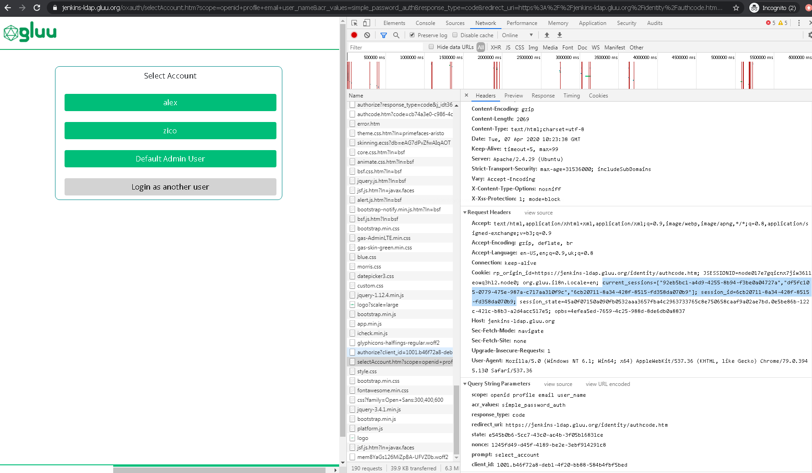

# Session Management

The Gluu Server OP stores user session data in its cache, whether it's in-memory, redis, memcached or the databse, depending on the `cacheProviderType` configuration property. 

The OP session can have one of two states:

- `unauthenticated` - when the end-user reaches the OP but has not yet authenticated, a session object is created and put in the cache with the `unauthenticated` state.  
- `authenticated` - when the user has successfully authenticated at the OP. 

In the browser, the OP session is referenced via a `session_id` cookie.
 
Lets say the user hits Relying Party (RP) 1, which redirects to the OP for authentication. Once the user is authenticated, the OP creates a `session_id` cookie, sets the state to `authenticated`, and places it in the cache. If the user hits RP2, it will redirect the user to the OP for authentication, and since the session is already authenticated, the OP authenticates the user automatically for RP2 (without an authentication prompt).  
 
An application may also store its *own* session for the user. Upon logout from the OP, all RPs need to be notified so local sessions can also be cleared/ended. The best way to handle this currently is through "front-channel logout", as described in the [OpenID Connect Front Channel Logout specification](http://openid.net/specs/openid-connect-frontchannel-1_0.html). 

In practice, here's how it works:

 - The Gluu Server OpenID `end_session` endpoint returns an HTML page, which contains an iFrame for each application to which the user has authenticated. 
 - The iFrame contains a link to each application's respective logout URL. 
 - The special HTML page should be loaded in the background and not displayed to the user. 
 - The iFrame URLs should be loaded by the browser. 
 - Now, upon logout, the user is calling the logout page of each application, the local cookies are cleared, and the user is signed out of all applications.  

Learn more about the flow for logout across many applications in the [logout docs](../operation/logout.md).  

## Select Account

AS supports different accounts. To be able select account or login as another user within same user-agent authorization request must have `prompt=select_account`.

When user is logged in cookies looks as:
```
session_id: de510ab6-b06c-4393-86d8-12a7c501aafe
current_sessions: ["de510ab6-b06c-4393-86d8-12a7c501aafe"]
```

If RP sends Authorization Request with `prompt=select_account` and selects hits `Login as another user` button and authenticate then cookies looks as:
```
session_id: c691e83d-eb1b-41f0-b453-fab905681b5b
current_sessions: ["de510ab6-b06c-4393-86d8-12a7c501aafe", "c691e83d-eb1b-41f0-b453-fab905681b5b"]
```

AS represents accounts based on `current_sessions` cookies. It may contain outdated references but AS will filter it out and update on request. Thus page represents always actual/active sessions.



## Session Timeouts  

Session Timeout can be configured under `JSON Configuration` > `oxAuth Properties`.

The following properties related to OP session:

- `sessionIdLifetime` - lifetime of the OP session in seconds. It sets both the `session_id` cookie expiration property as well as the OP session object expiration (if `serverSessionIdLifetime` is not set or equals `0` which is default behavior) in the persistence. It's a global property for sessions. Starting in version `4.1`, it is possible to set value to 0 or -1, which means that expiration is not set (not available in `3.1.3` or earlier except `2.4.4`). In this case, the `session_id` cookie expiration value is set to the `session` value, which means it's valid until the browser session ends.
- `serverSessionIdLifetime` - dedicated property to control lifetime of the server side OP session object in seconds. Overrides `sessionIdLifetime`. By default value is 0, so object lifetime equals `sessionIdLifetime` (which sets both cookie and object expiration). It can be useful if goal is to keep different values for client cookie and server object.
- `sessionIdUnusedLifetime` - unused OP session lifetime (set by default to 1 day). If an OP session is not used for a given amount of time, the OP session is removed. 
- `sessionIdUnauthenticatedUnusedLifetime` - lifetime of `unauthenticated` OP session. This determines how long the user can be on the login page while unauthenticated.
- `sessionIdRequestParameterEnabled` - Boolean value specifying whether to enable session_id HTTP request parameter. Default value is `false` (since 4.2). 
- `sessionIdEnabled` - specifies whether it is allowed to authenticate user by session automatically (without end-user interaction).  
- `sessionIdPersistOnPromptNone` - specifies whether to persist or update the session object with data if `prompt=none`. Default value is `true`, so session is persisted by default.
- `invalidateSessionCookiesAfterAuthorizationFlow` - this is special property which specifies whether to invalidate `session_id` and `consent_session_id` cookies right after successful or unsuccessful authorization. 

Since the OP session has two states, `authenticated` and `unauthenticated`, the `sessionIdUnauthenticatedUnusedLifetime` is used when the OP session is `unauthenticated` and `sessionIdUnusedLifetime` is used when the OP session is `authenticated`.

Both `unused` properties specify a period of time in seconds. The OP calculates this period as `currentUnusedPeriod = now - session.lastUsedAt`. So for OP session with states:

- `unauthenticated` - if `currentUnusedPeriod` >= `sessionIdUnauthenticatedUnusedLifetime`, then the OP session object is removed.
- `authenticated` - if `currentUnusedPeriod` >= `sessionIdUnusedLifetime`, then the OP session object is removed.

The OP updates `lastUsedAt` property of the OP session object:

- initially, it is set during creation
- it is updated during each authentication attempt (whether successful or not successful)

It is important to note that the OP session `lastUsedAt` property is not updated during RP usage.

A list of oxAuth Properties for reference can be found in 
[oxAuth JSON Properties](../reference/JSON-oxauth-prop.md)

## FAQ

### How can we force the user to log out if the user is idle on the RP for 4 hours?

The OP doesn't know anything about end-user activity on the RP. Therefore, the RP has to track activity internally, and when the inactivity period is reached (in this case, 4 hours) the RP has to perform front-channel logout.

### How can we force the user to log out if the browser is closed?

Setting `sessionIdLifetime` to `-1` value sets the `session_id` cookie value to `expires=session`, and sets the OP session object to not have an expiration time. Most browsers clear cookies with `expires=session` when the browser is closed, removing the session object at that time. 
