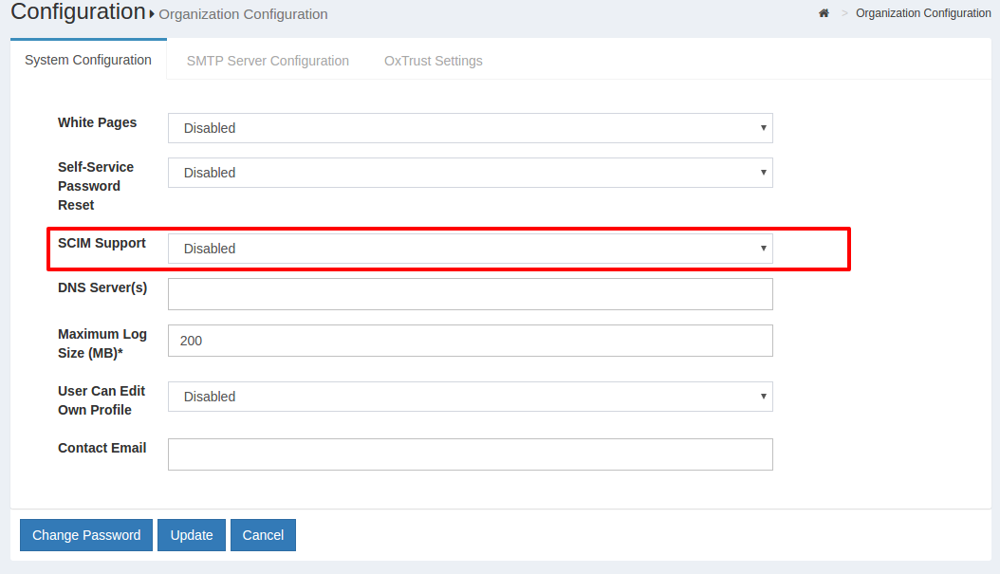

# Gluu API References

## Overview

The Gluu Server comes with a variety of APIs to help handle administration and configuration. 

## API Reference Links

Swagger documentation for Gluu Services can be accessed through the following links:

- [oxTrust](https://gluu.org/swagger-ui/?operationsSorter=alpha&url=https://raw.githubusercontent.com/GluuFederation/oxTrust/version_4.4.0/api-server/src/main/resources/META-INF/openapi.yaml)
- [oxAuth](https://gluu.org/swagger-ui/?url=https://raw.githubusercontent.com/GluuFederation/oxAuth/master/docs/oxAuthSwagger.yaml#/)
- [SCIM](https://gluu.org/swagger-ui/?url=https://raw.githubusercontent.com/GluuFederation/scim/master/scim-server/src/main/resources/gluu-scim-swagger.yaml)

## Additional Information

### SCIM

SCIM requires some additional configuration to get started.

To enable SCIM open the oxTrust administration interface and navigate to `Organization Configuration` > `System Configuration`. Find `SCIM Support` and select `Enabled`.

Then enable the protection mode you want for your API, see details [here](../user-management/scim2.md#api-protection).

#### SCIM Resource types

The following resources are supported:

|Resource|Schema URI|Notes|
|-|-|-|
|User|urn:ietf:params:scim:schemas:core:2.0:User|See [section 4.1](https://tools.ietf.org/html/rfc7643#section-4.1) of RFC 7643|
|Group|urn:ietf:params:scim:schemas:core:2.0:Group|See [section 4.2](https://tools.ietf.org/html/rfc7643#section-4.2) of RFC 7643|
|Fido u2f devices|urn:ietf:params:scim:schemas:core:2.0:FidoDevice|Represents a [fido u2f credential](../user-management/scim2.md#additional-features-of-scim-service) enrolled by a user|
|Fido 2.0 devices|urn:ietf:params:scim:schemas:core:2.0:Fido2Device|Represents a [fido 2.0 credential](../user-management/scim2.md#additional-features-of-scim-service) enrolled by a user|

Additionally the following resource extensions are defined:

|Resource|Schema URI|Attributes|
|-|-|-|
|User|urn:ietf:params:scim:schemas:extension:gluu:2.0:User|Attributes can be assigned dynamically via oxTrust|

In [this section](#conformance-matrix) we provide a conformance matrix where you can see which features from the spec are supported by Gluu implementation. 

To learn about the specific capabilities of the service, inspect your `/ServiceProvider`, `/ResourceTypes`,  and `/Schemas` endpoints (see [below](#service-provider-configuration-endpoints)). These endpoints are not protected so you can use a web browser to check. 

!!! Note 
    Unless otherwise stated, all endpoints are protected via [UMA 2.0](../user-management/scim2.md#protection-using-uma) or [test mode](../user-management/scim2.md#protection-using-test-mode). All payloads sent to endpoints using POST or PUT should be supplied using *Content-Type:* `application/scim+json` or `application/json`, and using UTF-8 encoding. Liwewise, output is sent from server in UTF-8.
    
#### SCIM Conformance matrix

The following table lists characteristics of SCIM protocol (see section 3 of RFC 7644) and correlates the level of support and conformance provided by Gluu Server implementation.

|Characteristic|Compliance|Available via methods|Notes on support|
|--------|--------|---------------|-------|
|Resource creation|Full|POST|Creation of Fido Devices not applicable|
|Resource retrieval by identifier|Full|GET||
|Resource(s) retrieval by query|Full|GET and POST|Supports searches from root endpoint too. Complex multi-valued attributes not supported in sortBy param|
|Resource attributes replacement|Partial|PUT|To avoid clients to accidentally clear data, only attributes found in payload are modified. No need to pass the whole resource nor required attributes|
|Resource attributes modification|Full|PATCH|All types of operations supported (add/remove/replace) for user and group resources|
|Resource removal|Full|DELETE||
|Bulk operations|Full|POST|Circular reference processing not supported. bulkIds can be used not only in "data" attribute of operations but in "path" too|
|Returned attributes control|Full|GET, POST, PUT, PATCH|Supports `attributes`/`excludedAttributes` params and attribute notation (sections 3.9/3.10)|
|"/me" URI alias|-|-|Not applicable: operations actually not executed on a user's behalf or other SCIM resource|
|Resource versioning|-|-|Feature may be available upon explicit customer demand|

!!! Attention
    If you are using Couchbase as your DB for Gluu, please also review our list of [SCIM Considerations when using CB](https://gluu.org/docs/cb/#scim-considerations). 
